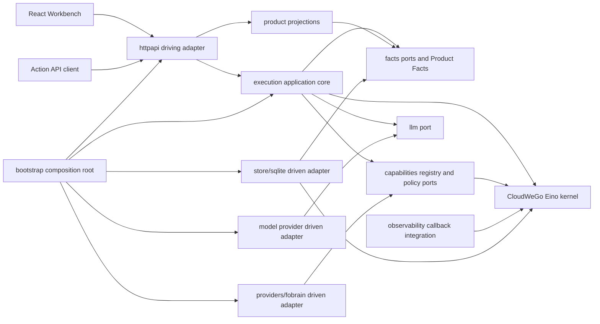
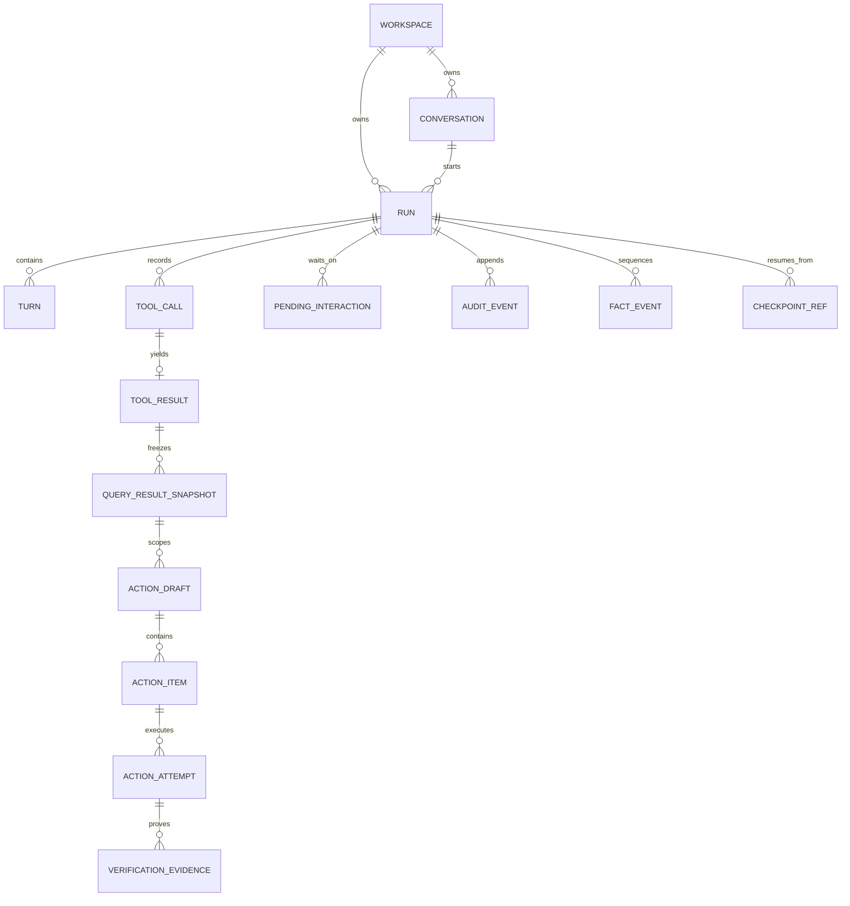
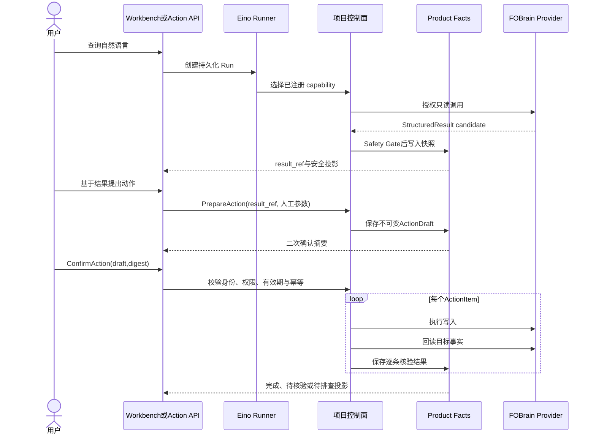

# Architecture Spine — Agent Platform Eino

## Design Paradigm

采用**六边形产品架构**：`facts`、`product` 与业务 provider DTO 保持框架无关，HTTP、LLM、SQLite、FOBrain 与 React Workbench 通过端口接入。运行时采用 **Eino-first, product-owned**：Eino 是指定集成包中的受控执行内核依赖，不伪装成当前不存在的独立 adapter；项目控制面负责可验证产品事实和所有安全决策。



除明确列入 AD-02 的 Eino 集成包外，依赖箭头只指向产品核心端口；`bootstrap` 是唯一允许同时认识核心和具体适配器的组合根。

## Current Implementation Gates

架构定义的是写域目标态，不构成当前实施授权。`implementation-readiness-gate.md` 是是否可以开始某项真实写域实现的唯一裁决来源。

| Gate | 当前约束 | 允许工作 |
| --- | --- | --- |
| G-READ-01 / G-READ-02 | 目标部署读取已验证，产品 capability 仍待实现 | 可实现精确新增查询与全部人员列表 |
| G-READ-03 | 7 项代表性只读接口有既有集成证据，但字段完整性、opaque ref→locator、v2 行级事实与产品投影仍待证明 | 可补 capability、schema、fixture、provider locator resolver 与只读产品 smoke；不得把接口 pass 当产品完成 |
| G-FACT-01 | BLOCKED | 只可补 StructuredResult、Product Facts、schema、fixture 与安全投影 |
| G-WRITE-01..04 | BLOCKED | 不得实现或启用真实外部 mutation；只可做契约、mock 和经批准的取证 |
| G-SAFE-01 | BLOCKED | 不得声明写域可交付；必须先证明未确认/取消时零写入 |
| G-ARCH-V2 | BLOCKED | 按纵向 Story 固定相应 v2 子集：M-1 建立 Product Facts/StructuredResult/QueryResultSnapshot/SSE 与 Greenfield bootstrap 的最薄只读链；M-4 才增加 Catalog/Action/Resume/Result 控制面。每个子集在启用对应 runtime writer 或产品入口前必须具备 schema、fixture 与 contract tests |
| G-TOOLCHAIN | PASS | Story 1.1 已完成；固定 Go 1.26.x、Node 24 LTS、GitHub Actions 与 canonical linux/amd64 image 的权威证据见 `docs/acceptance-records/story-1-1-g-toolchain-2026-07-15.md` |

每项动作只有其适用的 G-WRITE、共同 G-FACT-01、G-SAFE-01、G-ARCH-V2 与 G-TOOLCHAIN 均有验收记录标记为 PASS 后，才能进入真实写域实现；目标部署接口存在或本 Spine 标记 `[ADOPTED]` 都不能替代该门禁。

标记含义：`[ADOPTED]` 表示已由仓库现实或既有契约采用；`[ADOPTED TARGET]` 表示目标决策已经确认，但必须按 Greenfield ADR、目标架构 ADR 和 readiness gate 落地，不能当成当前实现事实。

## Invariants & Rules

### AD-01 [ADOPTED] — 六边形依赖方向

- **Binds:** all
- **Prevents:** HTTP、数据库、模型或 FOBrain 私有结构反向侵入产品核心。
- **Rule:** 核心端口由 `execution/facts/product/capabilities/llm/observability` 拥有；`httpapi/providers/*/store/*/web` 只能依赖端口或生成契约。`execution` 是 Run/Action 命令和状态迁移的唯一所有者，`facts` 只拥有领域类型与 repository ports，`product` 只读投影。跨层协作使用接口、命令、事实对象或注册表，禁止万能 `utils` 和跨层直接调用。

### AD-02 [ADOPTED TARGET] — Eino 执行面与项目控制面

- **Binds:** all Agent runs and tools
- **Prevents:** 自建第二套 Agent runtime，或让框架内部状态成为产品事实。
- **Rule:** 自然语言 Agent、模型工具选择、ReAct tool loop、Runner event、interrupt/checkpoint/callback 归 Eino；Product Facts、policy、approval、幂等、安全投影、HTTP/SSE、audit/replay 归项目。允许直接 import Eino 的包仅为 `execution`（Runner/interrupt）、`capabilities`（tool adapter）、`observability`（callback）与 `store/sqlite`（checkpoint interface）；`facts/product/httpapi/providers/*/web` 必须 Eino-free。自然语言工具编排进入 Eino Runner；确定性 Action API 可绕过模型，但进入同一 execution command 与门禁。

### AD-03 [ADOPTED TARGET] — Product Facts 与 StructuredResult 单一事实链

- **Binds:** F-01..F-07, Workbench, Action API, replay, audit
- **Prevents:** 页面、API、审计、模型上下文各自形成一套真相。
- **Rule:** Provider 输出先归一化为 StructuredResult candidate，经 schema 和 Safety Gate 后才能写 Product Facts。v2 将安全 StructuredResult 以不可变 JSON 值连同 schema version、result_ref、SHA-256 内容摘要和大小持久化；ToolResult 不得只留摘要。Workbench、SSE、ActionResult、replay、audit、目标“事实／执行记录”面板与 LLM context 全部从同一事实投影；raw provider payload 永不越过 provider 边界。

### AD-04 [ADOPTED TARGET] — 当前状态加不可变事实记录，不做完整事件溯源

- **Binds:** facts, store/sqlite, replay
- **Prevents:** 为获得当前状态必须全量回放事件，或只有可变行而失去来源链。
- **Rule:** repository 持久化可直接读取的当前聚合状态，同时追加单调 sequence 的不可变事实与审计记录。历史记录用于来源、审计、诊断和产品 replay，不承诺重建整个数据库；状态迁移与对应事实追加在同一事务中完成。

### AD-05 [ADOPTED TARGET] — 查询结果是可冻结、可引用的事实

- **Binds:** F-01, F-02, F-03, F-07, result_ref
- **Prevents:** “这些漏洞”随重新查询、分页或上下文变化而改变。
- **Rule:** `QueryResultSnapshot` 是 `facts` 拥有的一等聚合，归属 `(workspace_id, conversation_id, actor_subject_id)`，并引用来源 run、tool result 与 result_ref；跨 conversation/actor 禁止复用。它按值冻结 Safety Gate 后的规范化 SnapshotItem、查询语义、`captured_at/expires_at`、coverage、稳定排序与来源摘要。coverage 区分 `complete_set` 与 `partial_page/incomplete`；“全部”只允许所有分页成功后的 `complete_set`，UI 每页 100 条只是投影。

### AD-06 [ADOPTED TARGET] — 模型理解指代，程序确定性锁定引用

- **Binds:** F-07, conversation context, clarification, result_ref, entity_ref
- **Prevents:** 模型从多次查询中猜选一次结果，或上下文压缩改变对象。
- **Rule:** 模型只提取显式 ref、序号、时间或查询标签；Reference Resolver 校验 workspace、conversation、actor、有效期和唯一匹配。只有一个合格候选时可自动采用；多个合理候选返回 `clarification_required`。压缩摘要只保留安全语义和 refs，具体数据由 Context Assembler 从 facts repository 重新加载。

### AD-07 [ADOPTED TARGET] — 不可变 ActionDraft 冻结写入意图

- **Binds:** F-02..F-06
- **Prevents:** 用户确认后目标、参数、接收人或范围被静默替换。
- **Rule:** `ActionDraft` 是 `facts` 拥有、由 `execution` 命令推进的聚合，保存 actor、capability/policy/verifier 版本、源 snapshot、完整 ActionItems、目标参数和确认摘要。`draft_digest=v1:base64url(SHA-256(JCS(confirmable_payload)))`；payload 固定包含 actor、版本化 capability/policy/verifier refs、snapshot id/digest、按确认显示顺序排列的 item identity/expected facts、动作参数与 expires_at，服务端生成并常量时间校验。一个 draft 对应一个 approval PendingInteraction 与一个一次性 approval ref；一次确认覆盖全部 items。任何变化创建新 version/digest；失效时旧草案 `expired/rejected`。

### AD-08 [ADOPTED TARGET] — 所有写入口使用同一二阶段协议

- **Binds:** F-02..F-06, Workbench, Action API
- **Prevents:** 某个入口跳过用户确认、policy 或幂等控制。
- **Rule:** Workbench 与 Action API 共用内部 `PrepareAction → ConfirmAction` command。传输映射固定为：`POST /api/workspaces/:workspace_id/agent/actions` 创建 action run/prepare；`POST /api/workspaces/:workspace_id/runs/:run_id/resume` 用 approval resume payload 提交 `action_draft_id/version/digest` 与决定。聊天路径通过 Eino interrupt/resume 等待，Action API 返回 `approval_required`。写域实现前直接发布目标 schema、fixture、OpenAPI 与 generated contract，不生成旧接口兼容 union；所有修改 capability 默认确认。

### AD-09 [ADOPTED TARGET] — 人工决策与权限 fail closed

- **Binds:** F-02..F-05
- **Prevents:** AI 决定接收人、误报、延时或扩大 FOBrain 可见范围。
- **Rule:** 接收人、误报判断、是否延时和新期限由用户输入并进入草案；registry/policy 在 prepare 与 confirm 双检。能力策略必须声明 `max_items`、`group_key`、`recipient_source_capability`、`actor_role_predicate`、`object_permission_predicate` 与确认投影。派发/转发只能选择 FOBrain 全员列表中的人，同一接收人可合并、不同接收人必须拆 draft；延时 `max_items=1` 且 actor 必须是管理员；误报必须通过“当前 actor 负责该漏洞”谓词。多条确认展示前 5 条并可进入完整冻结集合。未知权限 fail closed。

### AD-10 [ADOPTED TARGET] — 逐条执行、逐条回读、显式部分成功

- **Binds:** F-02..F-06
- **Prevents:** HTTP 2xx 被误报为成功，或批量部分失败被整批覆盖。
- **Rule:** 每个 ActionItem 独立执行并按版本化 verifier 回读。reducer 首先检查 `control_certainty`：失租约或无法证明仍持有当前 fencing lease 时直接记为 `manual_attention/待排查`。只有 `control_certainty=held`、`provider_acceptance=accepted`、真实只读 observed 与 expected 匹配且证据为 conclusive 时才记为 `succeeded/完成`；只有 `control_certainty=held`、provider 明确拒绝且版本化 policy 接受 conclusive not-applied 证明时才记为 definitive `failed/待排查`。其余 unknown/mismatch 在 deadline 与调用预算均未耗尽时记为 `reconciling/待核验`，任一耗尽仍无法证明目标时记为 `manual_attention/待排查`。批量允许部分成功，不自动补偿；unknown、manual_attention 和成功项都不得重复 mutation。确定失败项只有经新的人工判断与确认，且逐条绑定 `retry_of_action_item_id` 的新 draft 后才能重试；原 snapshot 过期时必须刷新，不能沿用旧冻结值。

| Control certainty | Provider／证据条件 | Deadline／预算 | Item | Run / ActionResult / Outcome | 产品状态 | mutation_retry_allowed |
| --- | --- | --- | --- | --- | --- | --- |
| `lost` | 任意；包含失租约前后的 match/mismatch/unknown | 任意 | `manual_attention` | `failed/blocked/partial|none_succeeded` | 待排查 | false |
| `held` | accepted + conclusive expected=observed + 真实 readback | 任意 | `succeeded` | 全部终态时 `succeeded/completed/all_succeeded|partial` | 完成 | false |
| `held` | rejected + policy 允许的 conclusive not-applied | 任意 | `failed` | 全部终态时 `succeeded/completed/partial|none_succeeded` | 待排查 | 仅新人工 retry draft |
| `held` | 其他组合，包括 rejected/unknown+match 或 unknown/mismatch | 均未耗尽 | `reconciling` | `running/running/none` | 待核验 | false |
| `held` | 其他组合，包括 rejected/unknown+match 或 unknown/mismatch | 任一耗尽 | `manual_attention` | `failed/blocked/partial|none_succeeded` | 待排查 | false |

### AD-11 [ADOPTED TARGET] — 幂等与不确定写入恢复

- **Binds:** mutation, resume, process restart
- **Prevents:** 重复确认、网络断开或进程重启造成重复派发和重复转发。
- **Rule:** 每个逻辑 item 同时保存 draft-scoped `mutation_key=v1:sha256(workspace|draft_id|draft_version|entity_subject_key|action_type)` 与跨 draft `semantic_mutation_key=smk.v1:base64url(SHA-256(JCS(canonical_payload)))`。canonical payload 固定 version、workspace、provider instance、`entity_subject_key`、action type 与按目标 schema 规范化的 target；字符串 NFC、时间 UTC RFC3339、missing/null 分离、集合排序规则均由 schema version 固定。Confirm 事务必须先获取以 semantic key 为唯一主键的 `SemanticMutationClaim`，再预留 attempt；两个普通 draft 并发时只有一个可 claim。任何既有 claim（`reserved_not_sent/sent/verifying/reconciling/succeeded/manual_attention/failed`）都阻断普通 draft；只有逐条绑定 definitive failed item 的新人工 retry 可在同一事务转移 claim并延续 lineage，且 claim 必须保存 `claim_origin=initial|failed_retry`、predecessor owner/status 与 lineage root。Attempt 只有 durable `reserved_not_sent` 可执行首次外部 mutation；在外部调用前原子转为 `sent`，此后无论响应、超时、失租约或重启都只允许 Verify/Reconcile，禁止重发。Confirm 后的 cancel/stop 是 draft 级全有或全无事务：仅当全部 attempts 仍为 `reserved_not_sent` 时，execution 才能逐项 CAS 为 `cancelled_before_send`、记录零 mutation证据，并按 claim 来源原子处置：首次 claim 转为不阻断普通新决策的 `released_zero_write`；从 definitive failed 转移来的 retry claim 恢复 predecessor owner/status=`failed`，只为取消的 child reservation 保留 tombstone。随后固定 Run/ActionResult 为 `cancelled/cancelled` 或 `stopped/stopped`、outcome=`none_succeeded`。任一 attempt 已 sent+ 时整个 cancel/stop 不修改任何 item 或 claim并返回 `action_already_sent`，Run 继续执行／核验。`reserved_not_sent→sent` 与取消 CAS 互斥；audit tombstone 不能代替权威 claim 状态。除该可证明未发送的来源感知处置外 claim 不自动释放，至少保留至 draft/audit retention、reconcile 窗口与 open attention 中最晚者。`client_request_id` 在 `(workspace, actor, operation)` 作用域唯一，同 key 不同 request digest 返回 conflict，重复同 digest 返回既有投影。传输契约分别输出 `read_retryable`、`verification_resumable`、`mutation_retry_allowed`，不得用一个通用 retryable 暗示可重发 mutation。

### AD-12 [ADOPTED TARGET] — Run 与客户端连接解耦

- **Binds:** execution, HTTP, SSE, checkpoint
- **Prevents:** 页面刷新或 SSE 断开导致 Run 丢失、重复或错误取消。
- **Rule:** HTTP 创建/查询 Run，后台 executor 按持久化状态和有期限租约推进；SSE 只订阅 Product Facts。`Run.status` 保持现有 `created/running/waiting/succeeded/failed/cancelled/stopped`；审批由 PendingInteraction 表达，`reserved_not_sent/cancelled_before_send/sent/verifying/reconciling/manual_attention` 仅属于 ActionItem/Attempt，不新增竞争的 Run enum。客户端断线不改变状态；cancel/stop 只有在所有待发送 attempt 通过 AD-11 的 CAS 证明未发送后才能终结 Run。

### AD-13 [ADOPTED TARGET] — Capability Registry 是工具能力的唯一目录

- **Binds:** all tools and providers
- **Prevents:** 按工具名、自然语言关键词或 provider 私有字段硬编码分支。
- **Rule:** capability metadata 声明 schema、risk、side effect、approval、timeout、credential、idempotency，并以稳定 `freshness_policy_ref`、`verification_policy_ref` 和动作约束引用扩展。当前 v1 catalog 尚无后三者；写域实现前必须版本化更新 catalog/schema/fixture。Eino tool schema、Action prepare、policy 和 routing 从注册表派生；项目 policy 优先于模型、MCP annotation 和 provider 声明。

### AD-14 [ADOPTED] — Provider 是不可信的外部边界

- **Binds:** providers/*, capabilities, facts
- **Prevents:** 外部 DTO、错误、凭据或 raw body 泄漏到核心和产品出口。
- **Rule:** provider adapter 负责输入映射、认证、超时、raw response 归一化和错误脱敏，只返回项目拥有的 candidate/typed error。provider 不得写 Product Facts 或产品 view，不得直接决定审批和成功；真实字段映射必须有 schema、fixture 和 live evidence。

### AD-15 [ADOPTED TARGET] — 实验期单操作人身份边界

- **Binds:** FOBrain experiment writes, audit
- **Prevents:** 由前端、模型或共享账号使用者伪造 actor。
- **Rule:** 当前 actor 只能来自 workspace FOBrain 凭据解析出的 current user，并规范化为 `actor_subject_id=provider_instance_id + stable_user_business_id`；显示名不参与身份比较，credential fingerprint 只作审计上下文。actor 与 draft、approval、attempt、policy 决策和 audit 绑定；解析失败时写域关闭。共享凭据不声称多人审计；多人开放前增加产品认证、会话身份和每用户/委托凭据。

### AD-16 [ADOPTED TARGET] — 产品 API 与前端只消费安全投影

- **Binds:** httpapi, product, web
- **Prevents:** 前端重建运行状态机或直接消费 Eino/provider 内部结构。
- **Rule:** OpenAPI 3.1 与 JSON Schema 2020-12 是传输契约；成功 body 使用业务 schema，错误统一 envelope。当前 SSE 查询时重排不满足稳定游标；迁移后必须使用 AD-24 的持久化 event id/sequence/Last-Event-ID。前端只消费 generated contracts；TanStack Query 管 server state，Zustand 只管 UI state，审批、事实和 Run lifecycle 不在前端复制。

### AD-17 [ADOPTED] — 首版浅色桌面 Workbench

- **Binds:** web/eino-workbench
- **Prevents:** 未经设计的移动端、暗色主题或第二套操作入口扩大首版范围。
- **Rule:** 首版只实现浅色桌面三栏，最小宽度 1180px；聊天是查询和动作入口，详情工作区只读展示冻结事实，写入只在聊天审批卡确认。视觉和可访问性遵循最终 UX Spine；不实现移动断点、触屏专用交互或暗色主题。

### AD-18 [ADOPTED TARGET] — 模块化单体、单实例 SQLite

- **Binds:** deployment, store/sqlite
- **Prevents:** 实验期过早拆微服务，或多个实例共享 SQLite 产生错误的一致性假设。
- **Rule:** 首版部署一个 Go 后端实例，React 静态构建独立交付；SQLite 启用 WAL、外键、busy timeout、事务和可验证备份，不允许多进程/多主机共享文件。多实例、高可用、多人并发写或网络文件系统需求触发迁移 ADR，默认评估 PostgreSQL。

### AD-19 [ADOPTED] — 安全、配置与可观察性不成为第二事实源

- **Binds:** all
- **Prevents:** 日志、telemetry、配置或模型上下文泄漏秘密并取代产品事实。
- **Rule:** 配置只来自受控配置文件；密钥只在 provider/llm 边界持有。日志和 callback 只记录脱敏诊断、trace、latency、token 和预算，不记录 raw prompt/completion/provider payload。audit/replay 引用 Product Facts；Safety Gate 同时约束工具候选、assistant 文本与所有产品出口。

### AD-20 [ADOPTED TARGET] — Product Facts v2 是唯一 Greenfield 事实基线

- **Binds:** facts, schemas, OpenAPI, SQLite, generated contracts
- **Prevents:** 为过渡实现保留第二套事实模型、旧 projection adapter、dual write 或历史恢复分支。
- **Rule:** QueryResultSnapshot、ActionDraft、ActionItem、ActionAttempt、FactEvent 与 VerificationEvidence 直接在唯一目标 domain/schema/repository 中实现。新数据库创建目标 schema epoch；旧 epoch 返回 `unsupported_schema_epoch` 且 readiness=false。v2 writer 启用前必须同时交付 fresh-database bootstrap、fixtures、OpenAPI、generated contracts 和映射 contract tests；不得生成 v1/v2 union 或兼容读取。

### AD-21 [ADOPTED TARGET] — 聚合状态与产品状态只有一张映射

- **Binds:** execution, facts, product, SSE, ActionResult
- **Prevents:** Run、Item、Attempt 和 ActionResult 各自定义竞争状态机。
- **Rule:** Run 只使用既有七态；等待由 Run=`waiting` + Pending 表达，执行/验证/reconcile 由 Run=`running` + Item/Attempt 表达。Item=`reconciling` 时产品状态唯一为“待核验”，Run/ActionResult=`running/running`；Item=`succeeded` 时为“完成”；Item=`failed` 或 `manual_attention` 时为“待排查”并创建独立 `attention_status=open`。全部 item 只含 succeeded/definitive failed 时 Run/ActionResult=`succeeded/completed`，outcome=`all_succeeded/partial/none_succeeded`；任一 `manual_attention` 或控制面无法安全收口时 Run/ActionResult=`failed/blocked`，outcome 仍按成功计数为 `partial/none_succeeded`，成功 item 不被覆盖。执行终态不等于 attention 关闭；首版无关闭命令，open attention 持续可发现。该映射必须进入 schema fixture、SSE、操作记录和投影测试，不允许 UX、provider 或前端另建映射。

### AD-22 [ADOPTED TARGET] — 审批、checkpoint、attempt 的崩溃一致性协议

- **Binds:** execution, facts, store/sqlite, Eino HITL
- **Prevents:** 可见审批没有 checkpoint、重复消费确认或崩溃后重复写入。
- **Rule:** waiting continuation 分两种 backend：聊天 Eino 路径先保存不可见 staged Eino checkpoint；确定性 Action API 保存项目 continuation record，不创建伪 Eino checkpoint。两者都经统一 ContinuationRef port，在 facts 事务中发布 Pending 并标记 retained；孤儿 staged 可清理，可见 waiting continuation 不得清理。Confirm 事务一次完成 approval ref 消费、Pending 终态、draft 校验/approved、attempt reservation 与 FactEvent，提交后才 resume/execute。executor lease 使用 epoch/fencing token；失租约外部调用按未知写入 reconcile。

### AD-23 [ADOPTED TARGET] — Verifier 是版本化项目端口

- **Binds:** F-02..F-06, capabilities, execution, providers/*
- **Prevents:** 每个 provider 用不同方式解释“接口成功”与回读一致。
- **Rule:** Catalog v2 通过 `verification_policy_ref` 指向 verifier id/version、回读 capability、expected/observed schema、settle timeout、poll interval、最大调用数与 AD-10 outcome mapping。`ActionAttempt` 是按 phase 判别的封闭 union：`reserved_not_sent` 禁止 sent-only 字段；`cancelled_before_send` 只允许由 Run cancel/stop 与来源感知 claim disposition 的同一 CAS 事务产生，且必须证明 mutation count=0；`sent+` 必填 immutable `sent_at`、`settle_deadline=sent_at+settle_timeout`、policy version、lease epoch 与预算计数；只有核验阶段允许 evidence/next poll 字段。Attempt 在首次外部 mutation 调用前原子进入 `sent`；之后即使调用是否到达 provider 未知也不得重发。每次 verifier 调用先事务预留并递增次数，再执行回读；崩溃不返还预算，重启不得重算 deadline 或次数。`VerificationEvidence` 是按 `evidence_kind=readback_observation|conclusive_non_application|control_loss` 判别的 union，共同携带 provider acceptance 与 `control_certainty=held|lost`；readback 分支才强制 observed StructuredResult ref/digest，明确拒绝／control-loss 分支禁止伪造 observed。项目 `ActionVerifier` 按 AD-10 的优先级生成 decision，唯一 reducer 必须先消费 control certainty，再消费 provider acceptance、relation、conclusiveness 和 deadline／预算；provider adapter 不得判定产品 outcome。Draft 冻结 verifier/policy/route/credential-binding version；confirm 只用当前 policy 做 deny-only 复核，冻结版本不可用则草案失效。

### AD-24 [ADOPTED TARGET] — SSE 使用持久化事实游标与确定 patch 代数

- **Binds:** facts, product, httpapi, web
- **Prevents:** 查询时重排 event id、断线后丢事件，以及前后端对数组/空字段采用不同 merge 规则。
- **Rule:** 聚合迁移与 FactEvent 在同一事务提交并获得 Run 内持久化 sequence；view 返回 `snapshot_sequence`，SSE 只发送其后的事件。event payload 仅允许完整实体 upsert 或显式 tombstone；数组默认 replace，keyed merge 必须在 schema 声明。旧/未知 Last-Event-ID 触发 `view.replaced` + 新高水位；客户端忽略 sequence 不递增的事件。

### AD-25 [ADOPTED TARGET] — SQLite 与运行环境 fail-closed 启动

- **Binds:** bootstrap, store/sqlite, execution, deployment
- **Prevents:** 非目标 schema epoch 或不满足连接约束的实例接流量，或 cleanup 删除可恢复事实。
- **Rule:** `store/sqlite` 统一 connection policy；启动验证 WAL 返回 `wal`，对每连接保证 foreign keys 与配置化 busy timeout，并固定 pool/transaction 策略。`bootstrap` 在监听前创建／校验目标 Greenfield schema epoch并完成 integrity/可写检查、恢复扫描；旧 epoch 返回 `unsupported_schema_epoch` 且 readiness=false，不自动迁移或删库。waiting/running/reconciling 以及 `attention_status=open` 的引用材料禁止清理，首版 terminal facts/audit 不自动物理删除；备份必须 restore 到临时库并通过 integrity/schema 检查。

### AD-26 [ADOPTED TARGET] — 操作记录是 Product Facts 的安全只读投影

- **Binds:** facts, product, httpapi, web, ActionResult, audit
- **Prevents:** 从聊天摘要或重新调用 FOBrain 重建历史、跨 actor 泄漏结果，或把历史记录变成未经确认的重试入口。
- **Rule:** 左侧固定“操作记录”入口由 `product` 从持久化 Product Facts、ActionResult、`attention_status` 与安全 audit refs 生成单一后端投影；禁止从 conversation summary、raw provider payload 或重新调用 FOBrain 重建事实。首版 actor 指 FOBrain 凭据主体，不代表自然人；读取要求 `(workspace_id, actor_subject_id)` 与记录精确相等，并按记录冻结的 `history_access_policy_ref` 使用当前授权能力证明全部对象仍可见，unknown/denied 时整批 fail closed，禁止过滤后重算历史结果。provider instance 改变不做身份别名或自动迁移。入口复用 IA-01 历史模式，详情进入 IA-02 且只读，不自动创建 ActionDraft 或 retry。

  `operation_at` 在操作记录首次发布时写入且永不改变：有 Pending 的流程一律使用 Pending `published_at`，无 Pending 的确定性操作才使用服务端 decision time；后续批准时间另存 `decision_at`，不得改变排序键。首个请求不接受客户端 `as_of`，由服务端生成 RFC3339 纳秒时间；在一个 SQLite 事务中按 Asia/Shanghai 六日历月规则计算 inclusive cutoff、求 `operation_at >= cutoff` 与 `lifecycle_open=true` 的去重 union，并把完整有序安全列表行物化为 facts-owned immutable `OperationListSnapshot`。该快照使用随机 opaque `operation_list_snapshot_ref`，冻结 workspace/actor、filters digest、as_of/cutoff、total、排序键、记录版本与安全列表投影；它不是 AD-24 的 Run-local `snapshot_sequence`，也不是新的业务事实或 draft 来源。open 仅指 Run=`waiting/running` 或 `attention_status=open`；首版 definitive failed/manual_attention 创建 open attention，`attention_status` 只允许 `not_applicable|open`，没有关闭命令。服务端按已物化的 `(operation_at DESC, run_id DESC)` 顺序分页；cursor 为服务端签发的 opaque、tamper-evident token，绑定 schema version、actor/workspace、filters digest、as_of、cutoff、operation_list_snapshot_ref 与 last keys。后续页只读取同一物化列表并对整批 frozen history policy 重新 fail-closed 验权；记录变化、新 Run 或 attention 变化不进入该快照。快照过期、丢失、篡改或 scope/filter 不匹配统一返回 `invalid_cursor`；Web 不追加、去重或重算 total。快照 TTL 来自配置且至少覆盖分页会话，过期后可清理；六个月不是 Product Facts 物理删除策略，事实、open lifecycle/attention 和审计保留继续服从 AD-25。

### AD-27 [ADOPTED TARGET] — 产品安全引用与 provider locator 必须分离

- **Binds:** F-07, QueryResultSnapshot, entity detail, providers/*
- **Prevents:** 把可见 `entity_ref` 当作真实 provider ID、通过字符串拆解泄漏定位信息，或生成 opaque ref 后无法打开详情。
- **Rule:** `facts` 首次识别 provider 业务对象时用 CSPRNG 生成随机、不可变的内部 `entity_subject_key=esk.v1:base64url(32_bytes)`；该 key 不依赖可轮换 secret 且不进入产品出口。版本化 workspace subject-derivation key 只用于生成 `EntityIdentityFingerprint=esf.v1.<key_version>:base64url(HMAC-SHA-256(key,JCS(provider_instance,entity_type,canonical_provider_business_identity)))` 别名；`(workspace,key_version,fingerprint)` 唯一映射一个 subject。解析新对象时必须用 active 与所有 retained key version 计算指纹并查找：任一命中则事务性为同一 subject 添加 active-version alias；多个 alias 指向不同 subject 时返回 `entity_identity_conflict` 并 fail closed；全部未命中才创建新 subject。旧 derivation key 只有在全部保留 subject 已具备新 alias、且相关 snapshot/draft/attempt/claim/locator/open attention/audit retention 均结束后才能退役；locator 加密密钥可独立轮换，但不得改变 subject。每个随机 opaque `entity_ref` 映射到 entity_subject_key；`ProviderLocator` 以 `(workspace, entity_subject_key, locator_version)` 为键加密保存真实 id、类型和路由。`LocatorRepository` 由 facts 拥有，`LocatorResolver` 是 capabilities 只读端口；解析链唯一为 `entity_ref → entity_subject_key → ProviderLocator`。semantic mutation key 只使用不可变 entity_subject_key，因此 secret 轮换前后必须命中同一 SemanticMutationClaim 与 locator lineage。Detail resolver 必须校验 workspace、actor、source capability、locator version、对象权限和有效期，不能从 ref 字符串恢复 locator。subject、fingerprint alias、locator 与 ref mapping 在任何 snapshot/draft/attempt/claim/open attention/audit 引用存在期间不得清理。ActionDraft 冻结 `history_access_policy_ref/version`，Pending、ActionResult 与 OperationRecord 原样携带；缺失／损坏返回 `history_policy_unavailable`，当前拒绝返回 `history_access_denied`，两者均整批 fail closed。FR-21～FR-24 的列表、详情、来源/采集时间、稳定缺失态、secret rotation 与 resolver 必须有 schema/fixture/contract test；既有接口 pass 只证明 provider integration，不证明 v2 产品事实交付。

## Consistency Conventions

| Concern | Convention |
| --- | --- |
| Stable IDs | `run_`、`turn_`、`result_ref`、`query_snapshot_`、`action_draft_`、`action_item_`、`attempt_` 为产品安全 ID；内部 checkpoint/interrupt/credential ref 不外露。 |
| Naming | Go package 按职责使用小写单词；schema 文件 `<contract>.vN.schema.json`；capability id 集中登记，不散落在业务分支。 |
| Time | API 使用 RFC 3339；产品显示统一 UTC+8；所有事实同时保留来源时间与采集时间，不用本地展示字符串做比较。 |
| Ordering | 同一 Run 的事实 `sequence` 单调递增；查询集合保存稳定排序与 tie-breaker；SSE 重连按 event id/sequence 去重。 |
| Errors | 边界错误先归类再脱敏；产品只暴露稳定 code、中文安全摘要、retryable 与 request id；未知写入结果不得折叠为普通失败。 |
| Mutation | 只允许经 `PrepareAction → ConfirmAction → ExecuteItem → VerifyItem` 状态机推进；所有终态幂等。 |
| Config | provider、模型、端口、URL、凭据、预算、timeout、freshness、approval policy 均配置化或注册表化，不写入业务逻辑。 |
| Comments | 新增公共类型、接口、复杂状态机、事务与安全边界使用简短中文注释说明设计意图。 |

## Stack

| Name | Version |
| --- | --- |
| Go module language（目标基线） | 1.26.0 |
| Go CI/release toolchain（精确目标） | 1.26.5 |
| CloudWeGo Eino | 0.9.12 |
| eino-contrib/jsonschema | 1.0.3 |
| modernc SQLite | 1.46.2（SQLite 3.51.3 安全下限） |
| OpenAPI | 3.1 |
| JSON Schema | 2020-12 |
| Node.js（迁移目标） | 24.x LTS |
| React / React DOM | 19.2.7 |
| React Router DOM | 7.18.1 |
| TanStack React Query | 5.101.2 |
| Zustand | 5.0.14 |
| Vite | 8.1.0 |
| Vitest | 4.1.9 |
| Radix Collapsible / ScrollArea / Tabs / Tooltip（lockfile） | 1.1.14 / 1.2.12 / 1.1.15 / 1.2.10 |

上表是 Greenfield 唯一目标基线；精确前端安装只由提交的 `package-lock.json` + `npm ci` 证明。Eino 保持 v0.9.12 稳定线；v0.10 alpha 不进入本架构。modernc SQLite 的安全下限由 [`2026-07-20-modernc-sqlite-wal-safety-floor.md`](../../../../docs/adr/2026-07-20-modernc-sqlite-wal-safety-floor.md) 固定，Story 1.2 必须在启用 WAL 前完成升级并验证运行时 SQLite 不低于 3.51.3。Go 1.26.0/1.26.5 与 Node 24 LTS 工具链已由 Story 1.1 落入 module、CI、版本文件和 canonical image，并由权威记录裁决 `G-TOOLCHAIN=PASS`。其他 Go/Node 结果不能作为兼容路径或通过证据；后续提交仍须在该基线运行受影响验证。基础架构 major/破坏性升级必须 ADR，普通依赖维护不得混入业务 Story。

## Structural Seed

```text
cmd/eino-workbench/              # 单一后端进程入口
internal/einoapp/
  bootstrap/                     # 唯一 composition root
  httpapi/                       # HTTP、JSON、SSE 边界
  execution/                     # Eino 编排、Run、draft、confirm、recovery
  facts/                         # Product Facts、聚合与 repository ports
  product/                       # Workbench/Action/replay/audit 安全投影
  capabilities/                  # registry、policy、provider ports、tool adapter
  llm/                           # 模型端口、网络策略、脱敏错误
  observability/                 # trace、metrics、budget、诊断
  providers/fobrain/             # FOBrain connector adapter
  store/sqlite/                  # facts/checkpoint 持久化 adapter
web/eino-workbench/src/
  app/                           # Router 与 Query client
  contracts/generated.ts         # 唯一前端 DTO 边界
  features/workbench/            # 三栏 Workbench 组合
  components/                    # 无业务事实的 primitives/layout
docs/schemas/                    # JSON Schema 2020-12
docs/fixtures/                   # 契约与失败场景 fixture
```





## Capability → Architecture Map

| Capability / Area | Lives in | Governed by |
| --- | --- | --- |
| F-01 授权事实与统一卡片 | capabilities, providers/fobrain, facts, product | AD-03, AD-05, AD-13, AD-14 |
| F-02 新增漏洞手动派发 | execution, facts, capabilities | AD-07..AD-11, AD-15 |
| F-03 责任人转发 | execution, facts, capabilities | AD-07..AD-11, AD-15 |
| F-04 直接修复延时 | execution, facts, providers/fobrain | AD-07..AD-11, AD-14, AD-15 |
| F-05 误报标记 | execution, facts, providers/fobrain | AD-07..AD-11, AD-14, AD-15 |
| F-06 共同安全与结果 | product, facts, observability | AD-03, AD-08..AD-11, AD-19 |
| FR-19 当前用户上下文 | `tool.fobrain.current_user_context` → capabilities, providers/fobrain, facts, product | AD-03, AD-13..AD-16；G-READ-03，源字段 unavailable 不等于 resolved |
| FR-20 当前权限范围 | `tool.fobrain.my_permissions` → capabilities, providers/fobrain, facts, product | AD-03, AD-13..AD-16；G-READ-03，resolved/confirmed empty/source unavailable 三态 |
| FR-21 按 IP 查资产 | `tool.fobrain.list_assets_by_ip` → capabilities, providers/fobrain, facts, product | AD-03, AD-05, AD-13, AD-14, AD-27 |
| FR-22 资产详情 | `tool.fobrain.get_asset_detail` → capabilities, providers/fobrain, facts, product | AD-03, AD-05, AD-13, AD-14, AD-27 |
| FR-23 按 IP 查漏洞 | `tool.fobrain.list_vulnerabilities_by_ip` → capabilities, providers/fobrain, facts, product | AD-03, AD-05, AD-13, AD-14, AD-27 |
| FR-24 漏洞详情 | `tool.fobrain.get_vulnerability_detail` → capabilities, providers/fobrain, facts, product | AD-03, AD-05, AD-13, AD-14, AD-27 |
| FR-25 全部业务系统 | `tool.fobrain.business_list` → capabilities, providers/fobrain, facts, product | AD-03, AD-13..AD-16；不得替换为 my_business_systems |
| 多轮指代与上下文压缩 | execution, facts | AD-05, AD-06 |
| Workbench / Action API | httpapi, product, web | AD-03, AD-08, AD-16, AD-17 |
| Run、审批与进程恢复 | execution, store/sqlite | AD-08, AD-11, AD-12, AD-18 |
| FOBrain 能力接入 | capabilities, providers/fobrain | AD-09, AD-13..AD-15 |
| Product Facts v2 Greenfield 基线与旧 epoch 拒绝 | facts, store/sqlite, product | AD-03..AD-05, AD-20, AD-21 |
| SSE 断线恢复 | facts, product, httpapi, web | AD-12, AD-16, AD-24 |
| SQLite 启动、迁移、备份与恢复 | bootstrap, store/sqlite, execution | AD-18, AD-22, AD-25 |
| 跨会话操作记录与待处理结果 | facts, product, httpapi, web | AD-21, AD-24..AD-26 |
| opaque ref 与详情定位 | facts, capabilities, providers/fobrain | AD-05, AD-06, AD-14, AD-27 |
| 写域实施准入 | implementation-readiness-gate.md | Current Implementation Gates, AD-20..AD-23 |

## Deferred

| Decision | Reason / trigger |
| --- | --- |
| 产品登录、SSO 与每用户凭据 | 本轮是受控单操作人实验；多人开放前必须解决，见 AD-15。 |
| PostgreSQL、多实例与高可用 | 当前单实例 SQLite 足够；出现多人并发、HA 或共享存储需求时新增迁移 ADR。 |
| 自动派发、自动选择接收人、自动误报/延时 | 明确不在 PRD 本轮范围，且会改变人工决策安全边界。 |
| 通知、催办与工单闭环 | 明确不在本轮产品目标。 |
| MCP 生产 transport 与通用插件市场 | 当前只保留 capability provider 端口；待真实任务需要和安全模型完成后设计。 |
| 跨 session 自然语言长期记忆、向量检索与用户画像 | AD-26 只提供结构化操作记录与结果事实；跨会话聊天记忆仍需单独的数据与隐私决策。 |
| 暗色、移动端与触屏专用体验 | 最终 UX 已明确首版浅色桌面端；需求变化时先更新 UX 与 ADR。 |
| 完整 Event Sourcing/CQRS | 目标 v2 采用当前状态 + 不可变 FactEvent，但不以事件全量重建数据库；v2 尚受 G-ARCH-V2 阻塞。只有明确需要全量事件重建时重评。 |
