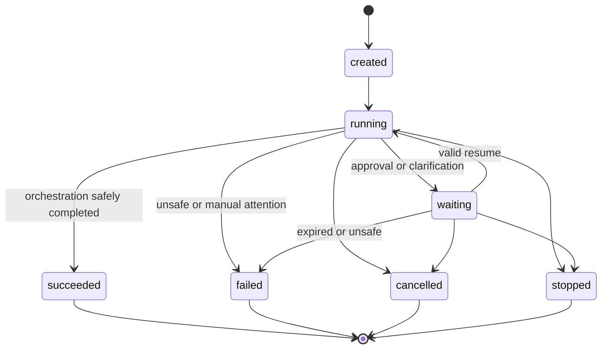
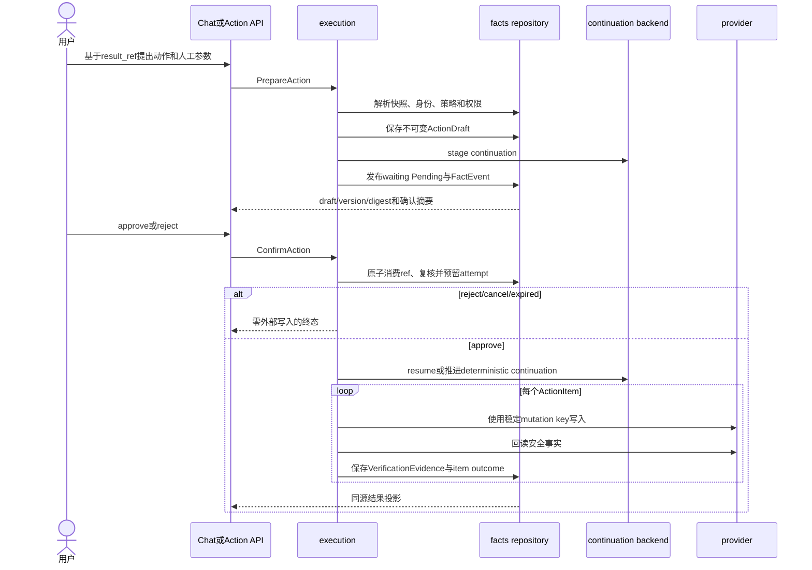
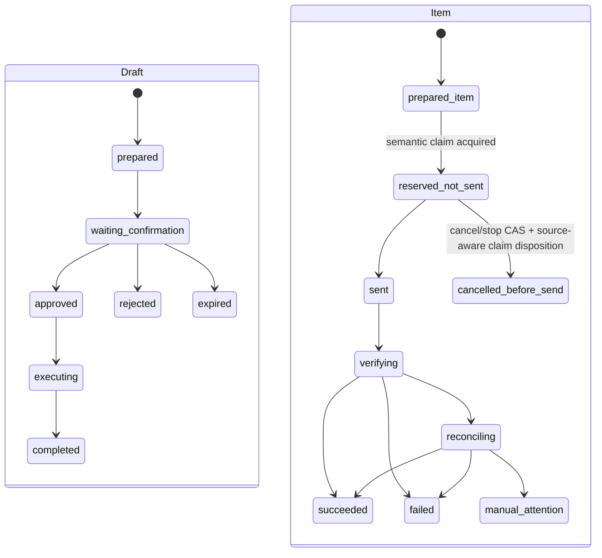
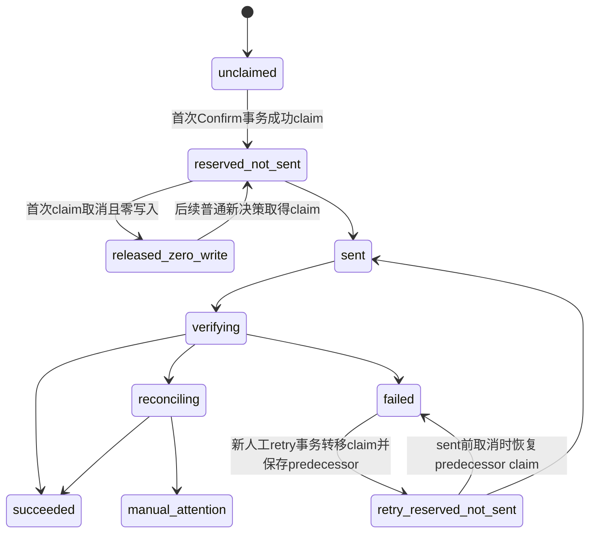
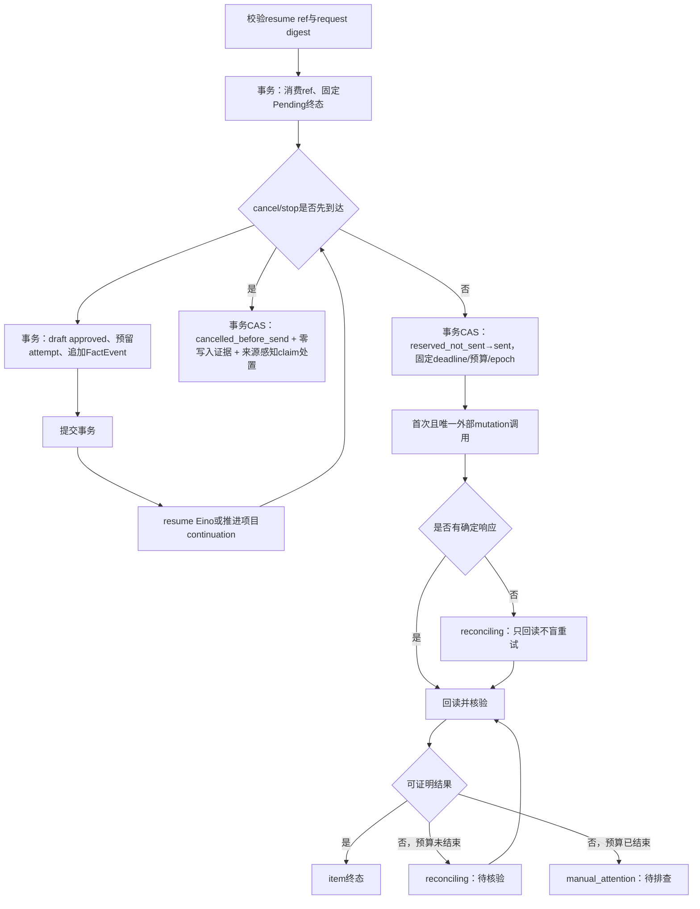
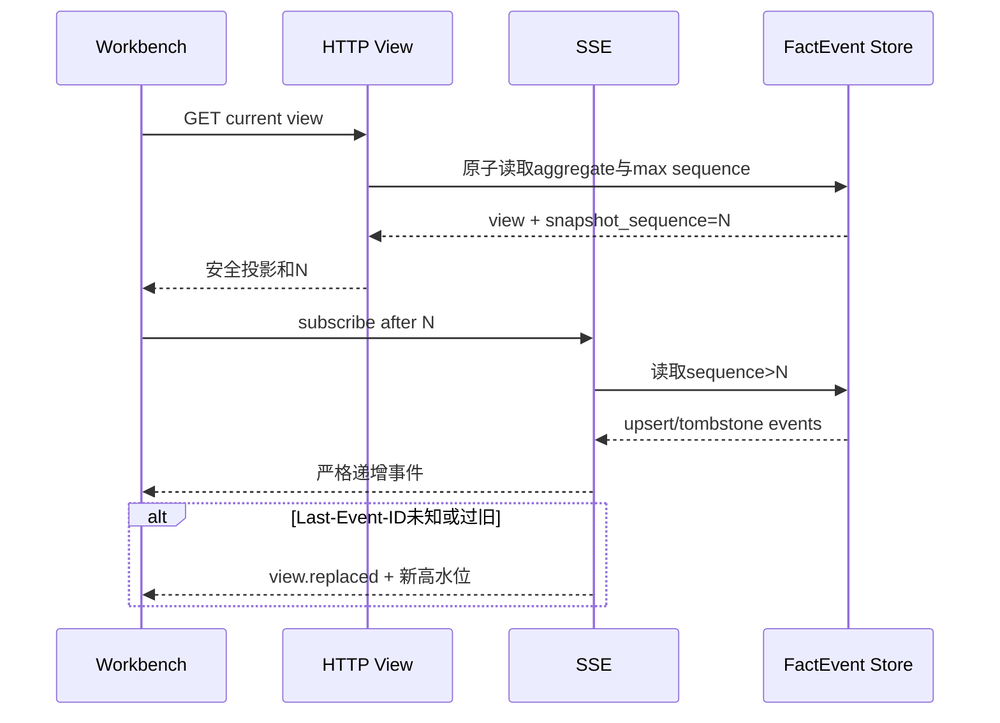
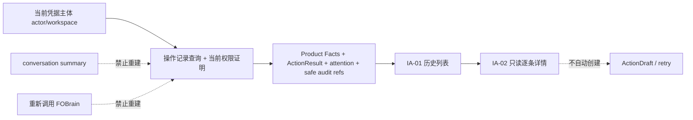

# State Machines

## 产品状态层级

Run 只使用上述七态。approval/clarification 由 PendingInteraction 表达；写入和核验阶段由 ActionItem/Attempt 表达。

## Prepare 与 Confirm

聊天 continuation backend 是真实 Eino checkpoint/interrupt；确定性 Action API backend 是项目 continuation record。两者实现统一 `ContinuationRef`，不能互相冒充。

## ActionDraft 与 Item 状态

聚合映射：

| Item 集合 | Run | ActionResult | Outcome |
| --- | --- | --- | --- |
| 全部 `succeeded` | `succeeded` | `completed` | `all_succeeded` |
| 成功与确定 `failed` 混合 | `succeeded` | `completed` | `partial` |
| 全部确定 `failed` | `succeeded` | `completed` | `none_succeeded` |
| 任一 `reconciling` | `running` | `running` | 未终结 |
| 任一 `manual_attention` 且存在成功项 | `failed` | `blocked` | `partial` |
| 任一 `manual_attention` 且无成功项 | `failed` | `blocked` | `none_succeeded` |
| 全部 `cancelled_before_send`，用户 cancel | `cancelled` | `cancelled` | `none_succeeded` |
| 全部 `cancelled_before_send`，系统／用户 stop | `stopped` | `stopped` | `none_succeeded` |

产品状态只采用以下映射：

| Item 状态／事实条件 | 产品状态 | 收敛规则 |
| --- | --- | --- |
| `reconciling`；mutation 可能已发生且仍在 verification policy 的 settle deadline／调用预算内 | 待核验 | Run 保持 `running`；沿同一 attempt 只回读，不得再次 mutation。 |
| `succeeded`；control held、provider accepted 且 conclusive 真实 readback 与 expected 一致 | 完成 | 终态，不得重复执行。 |
| definitive `failed`；provider 明确拒绝或可证明 mutation 未完成 | 待排查 | 条目终态；若要重试，必须重新人工判断并创建新 draft。 |
| `manual_attention`；deadline／预算结束仍无法证明目标，或失租约导致结果未知 | 待排查 | Run=`failed`、ActionResult=`blocked`；保留安全核验证据。 |
| `cancelled_before_send`；cancel/stop CAS 证明 mutation count=0 | 已取消／已停止 | attempt 与 Run 终态；首次 claim=`released_zero_write`，failed-retry claim 恢复 predecessor failed；child 审计 tombstone 保留。 |

VerificationEvidence reducer 的优先级不可配置：`control_certainty=lost` 首先进入 manual_attention；held + provider accepted + conclusive real-readback match 才 succeeded；held + provider rejected + policy 允许的 conclusive non-application 才 definitive failed；其余在 deadline／预算内 reconciling，耗尽后 manual_attention。`rejected|unknown + match` 不得成功；conclusive rejection 与 control-loss 不得伪造 observed StructuredResult。

verification deadline、已用调用次数和下一次允许回读时间必须持久化，服务重启不得重新计算或重置预算。`manual_attention` 明确由 FOBrain 系统负责人排查；本产品只呈现事实和排查指引，不发送通知、消息或工单。

definitive `failed` 与 `manual_attention` 都追加 `attention_status=open`，但不改变原执行终态。首版没有 attention 关闭命令；未来只能追加版本化 closure fact 和 audit，不能改写原 ActionResult。

## Semantic Mutation Claim

`(workspace_id, semantic_mutation_key)` 是 claim 唯一键。普通草案命中任何 active/retained claim 均失败；只有逐条绑定 definitive failed item 且 lineage 完整的新人工 retry 可以事务转移 claim。claim 插入／转移与 attempt 预留同事务，确保并发确认只有一个草案进入 attempt phase=`reserved_not_sent`；图中的 `retry_reserved_not_sent` 是 claim provenance，不是新的 Attempt phase。cancel/stop CAS 必须写 mutation count=0 和权威 claim disposition：首次 claim 进入 `released_zero_write`；retry transferred claim 恢复 predecessor owner/status=`failed`。取消 child 的 audit tombstone 不得替代该权威状态。若 sent CAS 先提交，处置失败并返回 `action_already_sent`。

## Confirm 事务与崩溃恢复

进程在 Confirm 事务提交前崩溃：确认未消费，可按同 request 重试。Confirm 提交后、`sent` 事务前崩溃：恢复同一 `reserved_not_sent` attempt，可执行一次首次调用；若已收到 cancel/stop，则只能用互斥 CAS 进入 `cancelled_before_send`，并将首次 claim 置为 `released_zero_write` 或恢复 failed-retry 的 predecessor failed claim。`sent` CAS 先提交后，无论调用是否真正到达 provider、响应是否丢失、租约是否变化或随后收到 cancel/stop，都只能回读／reconcile，不能再次写入或伪报取消。每次回读先原子扣减调用预算；崩溃不返还。

## Lease 与 Fencing

后台 executor 取得 `(run_id, lease_epoch, expires_at)`。所有事实提交携带 epoch；repository 拒绝小于当前 epoch 的迟到提交。新 owner 接管未知外部调用时只能回读或进入人工排查，不能凭租约接管而盲目重发。

## SSE 高水位

事件 payload 只允许完整实体 upsert 或显式 tombstone；数组默认 replace，只有 schema 明确声明 keyed collection 时可按 key 合并。客户端忽略 `sequence <= applied_sequence` 的事件。

## 操作记录投影

`operation_at` 在记录首次发布时固定且永不变化：有 Pending 的流程始终使用 Pending `published_at`，无 Pending 的确定性流程使用服务端 decision time，后续审批只写 `decision_at`。首个请求不接受客户端 `as_of`，由服务端生成 RFC3339 纳秒时间；转为 Asia/Shanghai 后，目标年月向前六个月，日取原日与目标月末较小值并保留时分秒／纳秒，边界包含。后端在一个 SQLite 事务中把窗口内记录与 Run waiting/running 或 attention open 的去重 union 物化为 immutable `OperationListSnapshot`，冻结完整有序安全列表行、记录版本和 total；它有独立 opaque `operation_list_snapshot_ref`，不是 Run-local SSE `snapshot_sequence`。后续页只读同一物化快照，其他 Run 变化不进入；cursor 绑定 scope、filters、as_of、cutoff、operation_list_snapshot_ref 与 last keys，篡改、丢失或 TTL 过期返回 `invalid_cursor`，前端不二次合并。查询要求 actor/workspace 精确相等，并按冻结访问策略证明快照内整批对象当前仍可见，unknown/denied 整批 fail closed，不过滤或重算。provider instance 改变不做身份别名。六个月不触发物理删除；首版 open attention 持续可发现，历史详情不推进状态，也不自动创建重试或新草案。
