# Fobrain Provider PoC 技术方案

## 目标

Phase 5 只验证 Fobrain provider 能以 Eino-first 能力提供方接入新链路：注册只读 PoC capability、解析安全凭据摘要、调用 provider client、生成 StructuredResult candidate，并由既有 Safety Gate 写入 Product Facts。它不是 24 个只读工具完整恢复，也不是旧项目迁移。

## 旧项目参考结论

旧项目 `/Users/vick/Desktop/project/ai-agent/internal/business/fobrain` 证明需要保留以下产品能力边界：

- capability catalog 必须包含 tool id、输入 schema、display 类型、policy 和凭据需求。
- adapter/client 负责真实 Fobrain HTTP 与凭据解析，raw provider payload 不进入产品层。
- domain/result mapper 负责把业务结果转成安全结果摘要。
- connector status、credential binding、实体消歧、写域审批是独立能力，不能互相替代。

新项目不得复制旧 `registry/providerapi`、旧 handler、旧 runtime step 或旧 Workbench 接口，只能把上述能力翻译为新 `capabilities.Provider`、`capabilities.Invoker`、`product.StructuredResultCandidate` 和 Product Facts 投影。

## Phase 5 范围

本阶段实现一个只读 PoC capability，建议选择 `tool.fobrain.current_user_context`，原因是输入最小、能覆盖凭据绑定、connector client、结果脱敏和工具卡展示。

本阶段不实现：

- 24 个只读工具完整矩阵。
- live write、ticket mutation、approval resume。
- 实体消歧和 clarification。
- connector health polling 长周期任务。
- 旧 UI presenter 或旧 DOM/CSS。

## 目录与职责

```text
internal/einoapp/providers/fobrain/
├── provider.go       # 实现 Provider/ListCapabilities，并暴露 Invoker
├── catalog.go        # PoC capability catalog，集中声明 tool id、schema、policy
├── client.go         # FobrainClient 接口与 HTTP client 边界
├── credentials.go    # 凭据解析接口，只返回 provider client 内部可用 secret
├── tools.go          # capability args 校验和 catalog operation 分发
├── result.go         # Fobrain typed result -> StructuredResultCandidate
└── errors.go         # provider 错误到安全 reason 的折叠
```

`providers/fobrain` 只能依赖 `capabilities`、`product`、标准库和必要的配置类型，不反向依赖 `execution`、`httpapi`、Workbench 前端或旧项目包。

## Capability Catalog

PoC catalog 固定声明：

- `ID`: `tool.fobrain.current_user_context`
- `ProviderID`: `fobrain`
- `ToolName`: 与 capability id 保持一致，供 Eino tool schema 使用。
- `ResultSchema`: `fobrain.tool_result.v2`
- `RiskLevel`: `low`
- `SideEffect`: `read_external`
- `PolicyRef`: `policy:fobrain:read:v1`
- `PermissionScope`: `workspace`
- `CredentialBindingPolicy`: `required`
- `ConnectorID`: `fobrain`
- `ApprovalRequired`: `false`
- `IdempotencyRequired`: `false`

后续新增工具只能扩展 catalog 数据，不允许在 execution 或 HTTP handler 中按工具名称分支。

## 配置契约

Fobrain provider 配置必须按 `docs/fobrain-provider-config.md` 实现。Phase 5 先补 `bootstrap.Config` 的 Fobrain 配置测试，再接 provider client，避免在 provider、smoke 或测试里硬编码 base URL、workspace、timeout、connector 状态或 token。

本阶段配置边界：

- `configs/eino-workbench.example.yaml` 只能展示无 secret 示例。
- `configs/eino-workbench.local.yaml` 可以保存本机 `api_token`，但必须保持 ignored。
- 真实 Fobrain 认证参数名必须来自配置，当前环境使用 `authorization`，不能硬编码旧项目默认 header。
- `enabled=false` 或缺少 Fobrain 配置时不得注册 Fobrain provider。
- RedactedSummary 只能展示安全摘要，不展示 token、Authorization、raw credential ref 或 raw provider payload。

## 调用流程

```mermaid
flowchart LR
  A["LLM / Action selects capability"] --> B["capabilities.Registry"]
  B --> C["EvaluatePolicy"]
  C --> D["InvokerMux"]
  D --> E["providers/fobrain catalog operation"]
  E --> F["CredentialResolver"]
  F --> G["FobrainClient"]
  G --> H["typed provider result"]
  H --> I["StructuredResultCandidate"]
  I --> J["StructuredResultSafetyGate"]
  J --> K["Product Facts"]
```



policy 阻断、缺凭据、workspace scope denied 或 connector unavailable 时，返回安全错误或安全状态卡，不写 raw credential、token、Authorization、provider body。

## Result Mapping

provider client 返回 typed safe domain result，例如 `CurrentUserContextResult`。`result.go` 负责生成：

- `SchemaVersion`: `tool.structured_result.v1`
- `ResultRef`: `result:fobrain:current-user-context:<safe-id>`
- `SafeSummary`: 简短中文摘要，只包含可展示用户、部门、角色等安全字段

`tool.structured_result.v1` 是写入 Product Facts 的唯一事实 schema。`fobrain.tool_result.v2` 是 Fobrain 业务结果/展示 payload schema，用于 provider mapper 校验、fixture 和 Workbench 展示派生；它只能通过安全 `result_ref` 与 StructuredResult 关联，不能作为第二套 Product Facts 写入。若后续持久化完整 Fobrain payload，也必须放在 result artifact store 内部，Product Facts 仍只保存 StructuredResult ref 和 safe summary。

raw provider JSON 只允许在 client 边界内解析，不能进入 `StructuredResultCandidate`、Product Facts、ActionResult、SSE、audit 或 replay。

## 配置与凭据

Phase 5 可以使用 `configs/eino-workbench.local.yaml` 中 ignored 本地配置作为真实 smoke 输入，但生产代码不得直接读取环境变量。真实 token 只进入 `CredentialResolver` 和 HTTP client，产品层只使用 `capabilities.CredentialBinding` 安全摘要。

## 测试门禁

- catalog 注册一个只读 PoC capability，元数据与 `docs/fobrain-tool-matrix.md`、`provider-policy-and-credentials.md` 对齐。
- Fobrain 配置按 `docs/fobrain-provider-config.md` 校验，secret 不进入脱敏摘要。
- 缺凭据、workspace 不匹配、connector unavailable 均产生安全 reason，不泄漏敏感字段。
- mock client 成功结果能生成 StructuredResult candidate 并通过 Safety Gate。
- raw payload、token、Authorization、credential 字样被 Safety Gate 或 result mapper 拒绝。
- invoker unknown capability 返回安全错误，不触发 provider client。
- `fobrain-poc` smoke 必须先生成 `docs/schemas/fobrain/provider_poc_report.v1.schema.json` 对应报告，证明 provider/client/StructuredResult 链路可运行。
- 真实模型工具选择是附加门禁：只有 LLM 和 Fobrain 本地凭据齐全时生成 `docs/schemas/real-model-report.schema.json`；缺凭据时生成 `docs/schemas/skip-report.schema.json`，并用 `blocks_claims` 标记被阻断声明。

## 不可声明能力

Phase 5 完成后只能声明“Fobrain provider PoC 已接入新能力链路”。不得声明 24 只读恢复、live read 覆盖、写域审批可用、实体消歧可用或可替换旧项目 Fobrain 能力。
